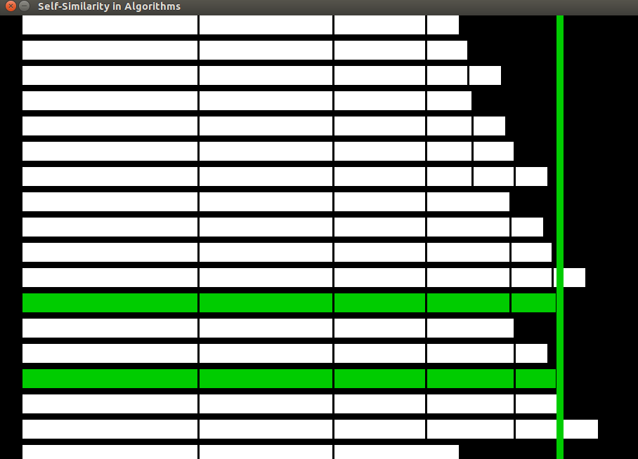

knapsack-problem-visualizer
===========================

A Python visualization of the [Knapsack Problem](http://en.wikipedia.org/wiki/Knapsack_problem).

Background
---------

I wrote this to help with Utah State University's 2014 High School Engineering fair. I was helping the CS department teach a class on "self similarity in algorithms" and the example was using recursion to solve the Knapsack problem. As part of the class students were given two physical problems to solve -- one possible, and one impossible. Then we walked them through coding the solution in Python.

This visualizer was written to help the students understand better what the algorithm was actually doing. As long as the algorithm is right, you just need the `@Puzzle` decorator in order to have the visualization of the algorithm display. (Yay, Python).

The visualizer code just spins up an extra Pygame thread that reads events off of a queue that are created from each call to the decorated function. It then visualizes them accordingly, with the "goal" on the right, and the attempt at filling it properly. Successes are highlighted in green.

Disclaimer: I was under a bit of a deadline to write this, so the visualization code may not be the cleanest (or most bug free).

